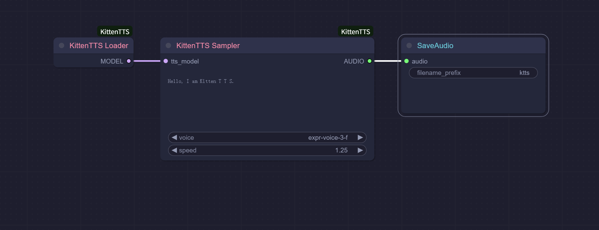

# ComfyUI-KittenTTS

Lightweight text-to-speech for ComfyUI powered by Kitten TTS (ONNX). CPU-friendly, fast to start, and easy to integrate in your audio workflows.

---

## Example Workflows

Use the included example as a reference to synthesize and save audio:



Demo video:

<video src="assets/demo.mp4" controls width="720"></video>

---

## Features

- Lightweight ONNX model (runs well on CPU)
- Zero-config loading (auto-downloads the default model)
- Standard ComfyUI AUDIO output

---

## Installation (Manual)

1. Navigate to your ComfyUI's `custom_nodes` directory
   ```
   cd ComfyUI/custom_nodes
   ```

2. Clone this repository:
   ```
   git clone https://github.com/neverbiasu/ComfyUI-KittenTTS
   cd ComfyUI-KittenTTS
   ```
3. Install Python dependencies:
    ```
    pip install -r requirements.txt
    ```

3. Install eSpeak NG and ensure its bin folder is on PATH. Restart ComfyUI afterwards.

---

## Troubleshooting

- Phonemizer/eSpeak errors: install eSpeak NG, ensure it’s on PATH, then restart ComfyUI.
- AUDIO output errors in downstream nodes: ensure upstream provides a dict with `{"waveform": Tensor[B,C,T], "sample_rate": int}`; this node outputs `[1,1,T]` at 24000 Hz.
- Model download issues: check network access to Hugging Face and retry.

---

## Acknowledgements

- [Kitten TTS](https://github.com/KittenML/KittenTTS) by KittenML

---

## License

See the LICENSE file in this repository.
